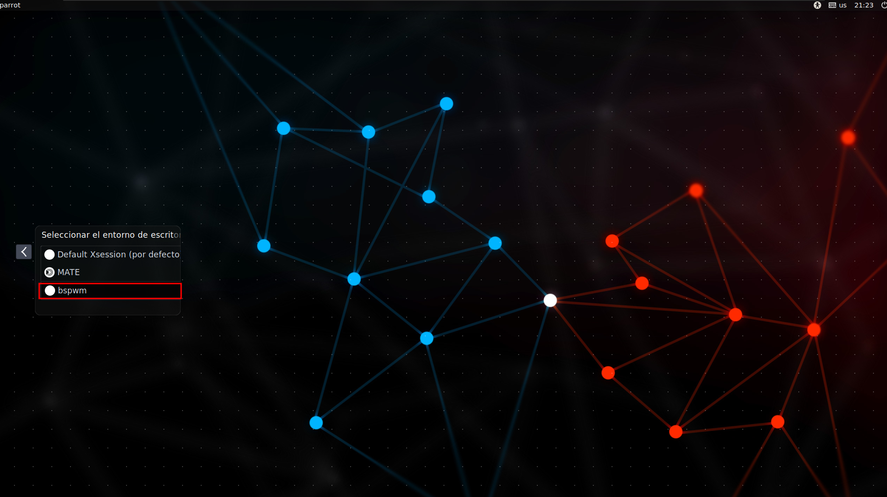
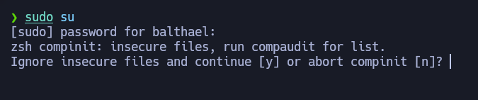
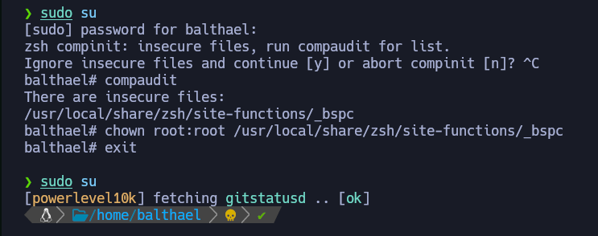

# Entorno de S4vitar en Parrot 100% Funcional


Bienvenidos a la guía de personalización del entorno de S4vitar en Parrot. Aquí encontrarás todos los pasos necesarios para una instalación completa y funcional.

## Video Tutorial

Puedes seguir el video tutorial paso a paso en mi [canal de YouTube](https://youtu.be/YUgXB2IZtcQ). Si el contenido es de tu agrado, considera suscribirte y seguirme en [LinkedIn](https://www.linkedin.com/in/johnosoriob/).

## Instalación

Clona el repositorio y prepara la instalación con los siguientes comandos:

```bash
git clone https://github.com/Balthael/ParrotEntorno
cd ParrotEntorno
chmod +x install.sh
sudo ./install.sh
```

Después de la instalación, asegúrate de seleccionar BSPWM e instalar `fzf` y `nvim`, ya que no están incluidos en el script inicial.

 

### Problemas comunes

Si encuentras un error al cambiar al usuario root, sigue estos pasos para corregirlo:



Solución:

```bash
Ctrl + C
compaudit
chown root:root /usr/local/share/zsh/site-functions/_bspc
exit
```



### Instalación de fzf

Instalación para usuarios root y no privilegiados:

**Root:**

```bash
sudo su
```

```bash
git clone --depth 1 https://github.com/junegunn/fzf.git ~/.fzf
~/.fzf/install
```

**Usuario no privilegiado:**

```bash
git clone --depth 1 https://github.com/junegunn/fzf.git ~/.fzf
~/.fzf/install
```

### Instalación de Neovim

#### Para Usuario No Privilegiado:
Cada linea de comando por separado.

```bash
- Nos clonamos el NvChad como usuario no privilegiado `git clone https://github.com/NvChad/starter ~/.config/nvim`
- `sudo su` --->Nos convertimos en root 
- `cd` --->Para ir a la raíz
- `mkdir /opt/nvim`
- `cd /opt/nvim`
- `mv /home/balthael/ParrotEntorno/neovim/nvim-linux64 .` Movemos la carpeta nvim-linux64 que esta en el repositorio del entorno que clonamos  a la ruta creada.
- Nos cambiamos a usuario no privilegiado
- `cd /opt/nvim/nvim-linux64/bin `
- `./nvim` 
- `sudo apt remove neovim`  
- `nvim`

```

#### Para Usuario Root:

```bash

- `sudo su` ---> Para volvernos root
- `cd /root/.config/` ---> Ir a la carpeta raíz de root
- `cp -r /home/balthael/.config/nvim .` ---> Copiamos de forma recursiva la carpeta nvim 
- `cd /root/.config/nvim` ---> vamos a la ruta nvim 
- `nvim` ---> Ejecutamos nvim 

```
 Para quitar el $ de nvim ver el video.
## Contacto

Si tienes preguntas o necesitas ayuda, no dudes en escribirme a mi [LinkedIn](https://www.linkedin.com/in/johnosoriob/).

Gracias

